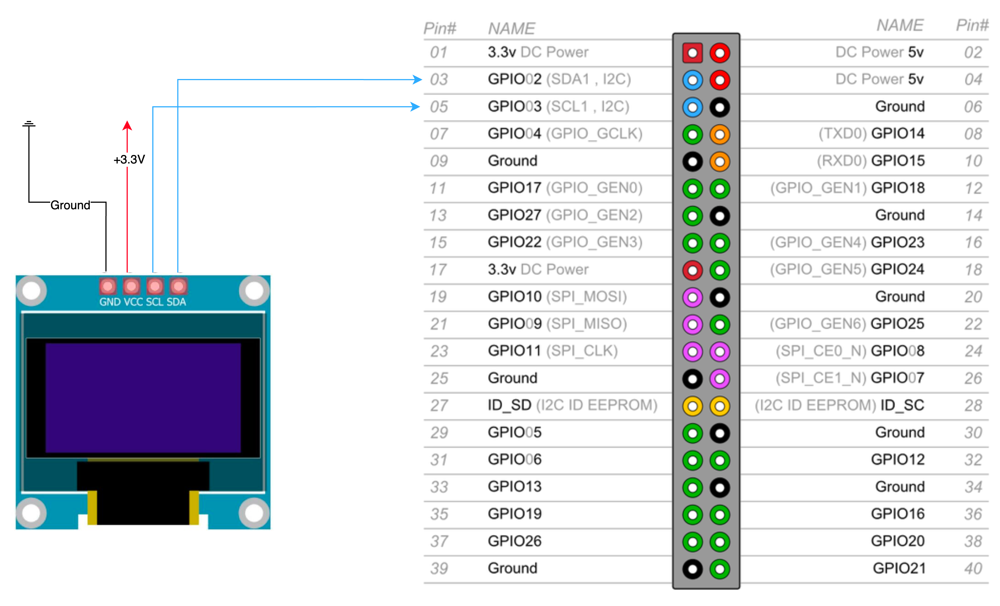
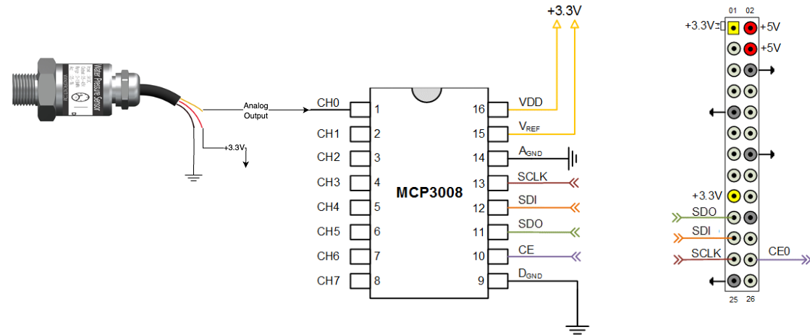

# Smart Espresso

[](https://www.python.org/downloads/)
[](LICENSE)
[](https://github.com/idoshr/smart-espresso)

_**WORK IN PROGRESS**_

DIY espresso machine monitoring with Raspberry Pi 4, pressure sensors, OLED display, and optional Home Assistant integration.

## Features

- Real-time pressure monitoring (boiler & brew head)
- Dual ADC support: MCP3008 (10-bit SPI) or ADS1115 (16-bit I2C)
- OLED display (SH1106 128x64)
- Home Assistant integration
- Extensible sensor architecture

## Hardware

| Qty | Component | Link | Notes |
|-----|-----------|------|-------|
| 1 | Raspberry Pi 4 Model B (2GB+) | | Main controller |
| 1 | MCP3008 ADC **or** ADS1115 ADC | [MCP3008](https://a.aliexpress.com/_olcJc4g) / [ADS1115](https://a.aliexpress.com/_c3c7goPp) | ADS1115 default |
| 2 | Pressure Sensors (0-0.5MPa, 0-2MPa) | [AliExpress](https://a.aliexpress.com/_omToNFi) | ⚠️ Get 3.3V version (G1/8) |
| 1 | SH1106 OLED Display (1.3", I2C) | [AliExpress](https://a.aliexpress.com/_oEzEfpA) | Optional |
| 2 | Brass Pipe Fittings (F-F-M 1/8") | [AliExpress](https://a.aliexpress.com/_okOIGjW) | For sensor mounting |

**Tools**: Soldering iron, multimeter, ratchet wrench, Teflon tape

## Wiring

### OLED Display (I2C)


| Pi Pin | → | Display |
|--------|---|---------|
| 1 (3.3V) | → | VCC |
| 3 (SDA) | → | SDA |
| 5 (SCL) | → | SCL |
| 6 (GND) | → | GND |

### MCP3008 (SPI)


| Pi Pin | → | MCP3008 |
|--------|---|---------|
| 1 (3.3V) | → | VDD (16), VREF (15) |
| 6 (GND) | → | AGND (14), DGND (9) |
| 19 (MOSI) | → | DIN (11) |
| 21 (MISO) | → | DOUT (12) |
| 23 (SCLK) | → | CLK (13) |
| 24 (CE0) | → | CS (10) |

Connect sensors: VCC→3.3V, GND→GND, OUT→CH0/CH1

### ADS1115 (I2C)
| Pi Pin | → | ADS1115 |
|--------|---|---------|
| 1 (3.3V) | → | VDD |
| 3 (SDA) | → | SDA |
| 5 (SCL) | → | SCL |
| 6 (GND) | → | GND |

Connect sensors: VCC→3.3V, GND→GND, OUT→A0/A1

## Installation

```bash
# Enable interfaces
sudo raspi-config  # Enable I2C and/or SPI

# Install package
pip3 install smart-esppresso

# Or from source
git clone https://github.com/idoshr/smart-espresso.git
cd smart-espresso
pip3 install -e .
```

## Configuration

Set via environment variables:

```bash
export ADC_TYPE="ADS1115"          # or "MCP3008"
export HA_ENABLE="True"            # Optional
export HA_URL="http://192.168.1.100:8123"
export HA_TOKEN="your_token_here"
```

### Generating Home Assistant API Token

To integrate with Home Assistant, you need a long-lived access token:

1. Open your Home Assistant web interface
2. Click on your profile (bottom left corner)
3. Scroll down to "Long-Lived Access Tokens" section
4. Click "Create Token"
5. Give it a descriptive name (e.g., "Smart Espresso")
6. Copy the generated token and use it as `HA_TOKEN`

**Important**: Save the token immediately - it won't be shown again. For more details, see the [Home Assistant Authentication documentation](https://developers.home-assistant.io/docs/auth_api/#long-lived-access-token).

## Usage

See [main.py](main.py) for complete example.

```python
from smart_espresso.analog_sensor.ads1115_analog_sensor import ADS1115ADC
from smart_espresso.analog_sensor.pressure_analog_sensor import PressureAnalogSensor
from smart_espresso.smart_espresso import SmartEspresso

# Create sensors
analog_devices = [
    PressureAnalogSensor(adc=ADS1115ADC(pin=0, gain=2/3), name="Head", max_pressure_mpa=2.0),
    PressureAnalogSensor(adc=ADS1115ADC(pin=1, gain=2/3), name="Boiler", max_pressure_mpa=0.5),
]

# Run
se = SmartEspresso(analog_devices=analog_devices, client_ha=None, display=None)
se.run()
```

**With MCP3008**: Replace `ADS1115ADC(pin=0, gain=2/3)` with `MCP3008ADC(pin=0)` (keep `max_pressure_mpa` parameter)

## Troubleshooting

- **No devices**: `sudo raspi-config` → Enable I2C/SPI, then `sudo i2cdetect -y 1`
- **Wrong readings**: Verify 3.3V sensors, check wiring, wait for auto-calibration
- **Display issues**: Check I2C address with `sudo i2cdetect -y 1` (usually 0x3C)
- **HA errors**: Verify URL includes `http://`, check token validity
- **Permissions**: `sudo usermod -a -G spi,i2c,gpio pi && sudo reboot`

## Project Structure

```
smart_espresso/
├── analog_sensor/
│   ├── analog_sensor.py           # Base classes
│   ├── mcp3008_analog_sensor.py   # MCP3008 ADC
│   ├── ads1115_analog_sensor.py   # ADS1115 ADC
│   └── pressure_analog_sensor.py  # Pressure sensor
├── smart_espresso.py              # Main class
└── utils.py                       # Helpers
```

## Contributing

Pull requests welcome! Run tests with `pytest smart_espresso/test/`

## License

BSD 3-Clause License

## References

- [DFRobot Pressure Sensor](https://wiki.dfrobot.com/Gravity__Water_Pressure_Sensor_SKU__SEN0257)
- [Coffee4Randy's Project](https://sites.google.com/view/coffee4randy/home)
- [Raspberry Pi Pinout](https://pinout.xyz)

---

**Made with ☕ by coffee enthusiasts**

