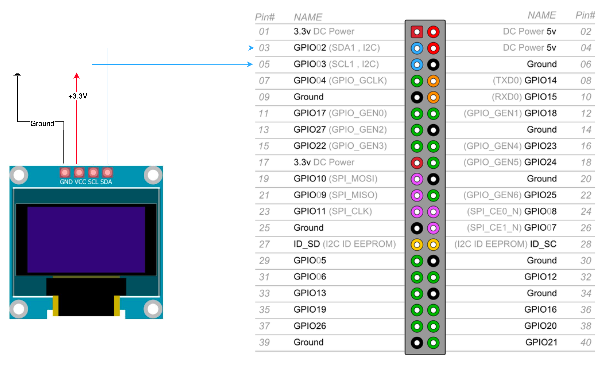
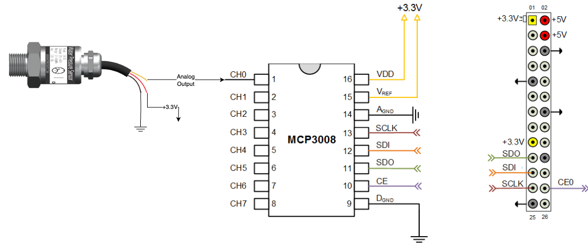

# Smart Espresso

[](https://www.python.org/downloads/)
[](LICENSE)
[](https://github.com/idoshr/smart-espresso)

_**WORK IN PROGRESS**_

DIY espresso machine monitoring with Raspberry Pi 4, pressure sensors, OLED display, and optional Home Assistant integration.

## Features

- Real-time pressure monitoring (boiler & brew head)
- Water flow / shot-volume metering (hall-effect pulse sensor)
- Temperature & humidity monitoring (DHT22 / AM2302)
- Dual ADC support: MCP3008 (10-bit SPI) or ADS1115 (16-bit I2C)
- OLED display (SH1106 128x64)
- Home Assistant integration
- Extensible sensor architecture

## Hardware

| Qty | Component | Link | Notes |
|-----|-----------|------|-------|
| 1 | Raspberry Pi 4 Model B (2GB+) | | Main controller |
| 1 | MCP3008 ADC **or** ADS1115 ADC | [MCP3008](https://a.aliexpress.com/_olcJc4g) / [ADS1115](https://a.aliexpress.com/_c3c7goPp) | ADS1115 default |
| 2 | Pressure Sensors (0-0.5MPa, 0-2MPa) | [AliExpress](https://a.aliexpress.com/_omToNFi) | ⚠️ Get 3.3V version (G1/8) |
| 1 | Mini Water Flow Sensor (DC3-24V, pulse output) | [AliExpress](https://a.aliexpress.com/_c4MPGp0X) | Optional — shot volume / flow rate |
| 1 | DHT22 / AM2302 Temp & Humidity Sensor | | Optional |
| 1 | SH1106 OLED Display (1.3", I2C) | [AliExpress](https://a.aliexpress.com/_oEzEfpA) | Optional |
| 2 | Brass Pipe Fittings (F-F-M 1/8") | [AliExpress](https://a.aliexpress.com/_okOIGjW) | For sensor mounting |

**Tools**: Soldering iron, multimeter, ratchet wrench, Teflon tape

## Wiring

### OLED Display (I2C)


| Pi Pin | → | Display |
|--------|---|---------|
| 1 (3.3V) | → | VCC |
| 3 (SDA) | → | SDA |
| 5 (SCL) | → | SCL |
| 6 (GND) | → | GND |

### MCP3008 (SPI)


| Pi Pin | → | MCP3008 |
|--------|---|---------|
| 1 (3.3V) | → | VDD (16), VREF (15) |
| 6 (GND) | → | AGND (14), DGND (9) |
| 19 (MOSI) | → | DIN (11) |
| 21 (MISO) | → | DOUT (12) |
| 23 (SCLK) | → | CLK (13) |
| 24 (CE0) | → | CS (10) |

Connect sensors: VCC→3.3V, GND→GND, OUT→CH0/CH1

### ADS1115 (I2C)
| Pi Pin | → | ADS1115 |
|--------|---|---------|
| 1 (3.3V) | → | VDD |
| 3 (SDA) | → | SDA |
| 5 (SCL) | → | SCL |
| 6 (GND) | → | GND |

Connect sensors: VCC→3.3V, GND→GND, OUT→A0/A1

### Water Flow Meter (GPIO pulse)

The flow sensor is a digital hall-effect device: it outputs a square-wave
pulse train whose frequency is proportional to flow rate. Wire its signal
line to a GPIO pin and count edges — it does **not** go through the ADC.
It has a 3-wire lead: **red = VCC, yellow = signal, black = GND**.

| Pi Pin | → | Flow Sensor |
|--------|---|-------------|
| 1 (3.3V) | → | VCC (red) |
| 6 (GND) | → | GND (black) |
| 11 (GPIO17) | → | Signal / OUT (yellow) |

✅ **Power it at 3.3V.** This sensor accepts DC 3-24V, so running VCC from
the Pi's 3.3V rail keeps the pulse output at 3.3V — safe for the Pi's GPIO
with **no level shifter needed**. (If you instead power it from 5V, the
output idles high near 5V, which exceeds the Pi's 3.3V GPIO limit — then
you'd need a resistor divider or logic-level shifter on the signal line.)
Enable the GPIO's internal pull-up in software; the hall output pulls the
line low on each pulse.

### DHT22 / AM2302 (GPIO 1-wire)

| Pi Pin | → | DHT22 |
|--------|---|-------|
| 1 (3.3V) | → | VCC |
| 7 (GPIO4) | → | DATA |
| 6 (GND) | → | GND |

A 10kΩ pull-up resistor between VCC and DATA is recommended (many AM2302
breakout modules include it on-board). See [example_dht22.py](example_dht22.py).

## Installation

```bash
# Enable interfaces
sudo raspi-config  # Enable I2C and/or SPI

# Install package
pip3 install smart-espresso

# Or from source
git clone https://github.com/idoshr/smart-espresso.git
cd smart-espresso
pip3 install -e .
```

## Configuration

Set via environment variables:

```bash
export ADC_TYPE="ADS1115"          # or "MCP3008"
export HA_ENABLE="True"            # Optional
export HA_URL="http://192.168.1.100:8123"
export HA_TOKEN="your_token_here"
```

### Generating Home Assistant API Token

To integrate with Home Assistant, you need a long-lived access token:

1. Open your Home Assistant web interface
2. Click on your profile (bottom left corner)
3. Scroll down to "Long-Lived Access Tokens" section
4. Click "Create Token"
5. Give it a descriptive name (e.g., "Smart Espresso")
6. Copy the generated token and use it as `HA_TOKEN`

**Important**: Save the token immediately - it won't be shown again. For more details, see the [Home Assistant Authentication documentation](https://developers.home-assistant.io/docs/auth_api/#long-lived-access-token).

## Usage

See [main.py](main.py) for complete example.

```python
from smart_espresso.analog_sensor.ads1115_analog_sensor import ADS1115ADC
from smart_espresso.analog_sensor.pressure_analog_sensor import PressureAnalogSensor
from smart_espresso.smart_espresso import SmartEspresso

# Create sensors
analog_devices = [
    PressureAnalogSensor(adc=ADS1115ADC(pin=0, gain=2/3), name="Head", max_pressure_mpa=2.0),
    PressureAnalogSensor(adc=ADS1115ADC(pin=1, gain=2/3), name="Boiler", max_pressure_mpa=0.5),
]

# Run
se = SmartEspresso(analog_devices=analog_devices, client_ha=None, display=None)
se.run()
```

**With MCP3008**: Replace `ADS1115ADC(pin=0, gain=2/3)` with `MCP3008ADC(pin=0)` (keep `max_pressure_mpa` parameter)

## Water Flow Meter Sensor

A hall-effect water flow sensor lets you measure **flow rate** (L/min) and
**dispensed volume** (total litres per shot). A small pinwheel inside the body
spins as water passes; a hall-effect sensor picks up the magnet on the wheel
and emits one voltage pulse per rotation. Because the output is a pulse train
— not an analog voltage — it connects straight to a GPIO pin and is read by
counting pulses over time, **not** through the MCP3008/ADS1115 ADC.

This project targets the compact **DC3-24V mini flow sensor** sold for coffee
machines (small plastic inline body with push-on hose barbs and a 3-wire
lead), which suits espresso's low flow far better than the larger threaded
YF-S201-style meters.

### Specifications

| Spec | Value |
|------|-------|
| Working voltage | DC 3–24 V (power at 3.3V for the Pi — see wiring) |
| Output signal | Hall-effect pulse (open-collector square wave) |
| Wiring | Red = VCC, Yellow = signal, Black = GND |
| Body / ports | Plastic inline, hose-barb (push-on tubing) |
| Typical use | Mini coffee machines, low-flow liquid metering |
| Flow rate range | ~0.3–3 L/min *(verify/calibrate — see below)* |
| K-factor (pulses/L) | **not printed on the listing — must be calibrated** |

> The listing does not publish an exact flow range or pulse constant, and
> small plastic flow sensors vary unit-to-unit, so **calibrate** rather than
> trusting a nominal K-factor (see below). For reference, a double espresso
> is roughly 60 mL in ~25 s ≈ 0.14 L/min — a slow flow, so verify your unit
> registers pulses reliably at that rate.

### How the reading works

- **Volume:** `Volume (L) = total_pulse_count / pulses_per_litre`.
- **Flow rate:** `Q (L/min) = 60 × pulses_per_second / pulses_per_litre`,
  equivalently `frequency_Hz / K` where `K` is the sensor's pulses-per-second
  per L/min constant.
- **Calibrate for accuracy (required here):** dispense a known volume (e.g.
  weigh 500 g ≈ 0.5 L of water), count the pulses, and set
  `pulses_per_litre = pulses / litres_dispensed`. Repeat at espresso-like
  flow rates, since the constant drifts with flow profile and plumbing.

### Integration

`WaterFlowAnalogSensor` in
[`smart_espresso/analog_sensor/water_flow_sensor.py`](smart_espresso/analog_sensor/water_flow_sensor.py)
provides the base class (reporting units in litres). Implement its `liter`
property to return the accumulated volume from your pulse counter — for
example a `gpiozero.Button`/edge-callback or an interrupt on the signal GPIO
that increments a counter, divided by the calibrated `pulses_per_litre`.

## Troubleshooting

- **No devices**: `sudo raspi-config` → Enable I2C/SPI, then `sudo i2cdetect -y 1`
- **Wrong readings**: Verify 3.3V sensors, check wiring, wait for auto-calibration
- **Display issues**: Check I2C address with `sudo i2cdetect -y 1` (usually 0x3C)
- **HA errors**: Verify URL includes `http://`, check token validity
- **Permissions**: `sudo usermod -a -G spi,i2c,gpio pi && sudo reboot`

## Project Structure

```
smart_espresso/
├── analog_sensor/
│   ├── analog_sensor.py           # Base classes (ADCInterface, AnalogSensor)
│   ├── mcp3008_analog_sensor.py   # MCP3008 ADC
│   ├── ads1115_analog_sensor.py   # ADS1115 ADC
│   ├── pressure_analog_sensor.py  # Pressure sensor
│   ├── water_flow_sensor.py       # Water flow meter (pulse) sensor
│   └── dht22_sensor.py            # DHT22 temp/humidity sensor
├── test/                          # Unit tests
├── smart_espresso.py              # Main class
└── utils.py                       # Helpers
```

## Contributing

Pull requests welcome! Run tests with `pytest smart_espresso/test/`

## License

BSD 3-Clause License

## References

- [DFRobot Pressure Sensor](https://wiki.dfrobot.com/Gravity__Water_Pressure_Sensor_SKU__SEN0257)
- [Coffee4Randy's Project](https://sites.google.com/view/coffee4randy/home)
- [Raspberry Pi Pinout](https://pinout.xyz)

---

**Made with ☕ by coffee enthusiasts**

