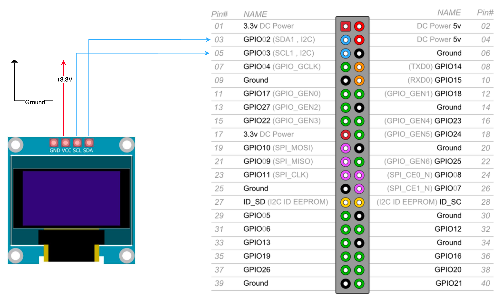
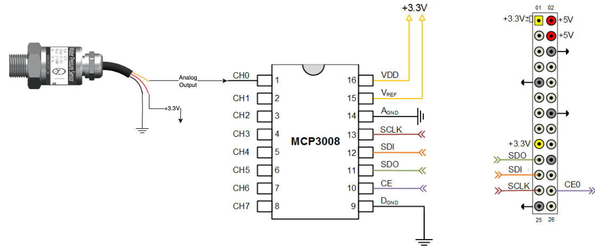

# Smart Espresso

[](https://www.python.org/downloads/)
[](LICENSE)
[](https://github.com/idoshr/smart-espresso)

_**WORK IN PROGRESS**_

DIY espresso machine monitoring with Raspberry Pi 4, pressure sensors, OLED display, and optional Home Assistant integration.

## Features

- Real-time pressure monitoring (boiler & brew head)
- Water flow / shot-volume metering (hall-effect pulse sensor)
- Temperature & humidity monitoring (DHT22 / AM2302)
- Dual ADC support: MCP3008 (10-bit SPI) or ADS1115 (16-bit I2C)
- OLED display (SH1106 128x64)
- Machine state classification (off / heating / ready / brewing / steaming / over pressure)
- Water tank counter with refill reset, so you know before the 2 L tank runs dry
- Mobile web dashboard: manometers, machine state, tank level, water used in the last 2 minutes
- Home Assistant integration
- Extensible sensor architecture

## Hardware

| Qty | Component | Link | Notes |
|-----|-----------|------|-------|
| 1 | Raspberry Pi 4 Model B (2GB+) | | Main controller |
| 1 | MCP3008 ADC **or** ADS1115 ADC | [MCP3008](https://a.aliexpress.com/_olcJc4g) / [ADS1115](https://a.aliexpress.com/_c3c7goPp) | ADS1115 default |
| 2 | Pressure Sensors (0-0.5MPa, 0-2MPa) | [AliExpress](https://a.aliexpress.com/_omToNFi) | ⚠️ Get 3.3V version (G1/8) |
| 1 | Mini Water Flow Sensor (DC3-24V, pulse output) | [AliExpress](https://a.aliexpress.com/_c4MPGp0X) | Optional — shot volume / flow rate |
| 1 | DHT22 / AM2302 Temp & Humidity Sensor | | Optional |
| 1 | SH1106 OLED Display (1.3", I2C) | [AliExpress](https://a.aliexpress.com/_oEzEfpA) | Optional |
| 2 | Brass Pipe Fittings (F-F-M 1/8") | [AliExpress](https://a.aliexpress.com/_okOIGjW) | For sensor mounting |
| 1 | Project Enclosure Box | [AliExpress](https://a.aliexpress.com/_c3qopgP1) | Houses the Raspberry Pi & electronics |

**Tools**: Soldering iron, multimeter, ratchet wrench, Teflon tape

> **Note on purchase links:** AliExpress listings expire over time. All links
> are kept in a single source of truth, [`docs/hardware.yml`](docs/hardware.yml),
> and checked automatically every week by the
> [Hardware Link Check](.github/workflows/link-check.yml) workflow. If a link
> above is dead, please update `docs/hardware.yml` and this table, or
> [open an issue](https://github.com/idoshr/smart-espresso/issues). Run the
> checker locally with `python scripts/check_links.py`.

## Wiring

### OLED Display (I2C)


| Pi Pin | → | Display |
|--------|---|---------|
| 1 (3.3V) | → | VCC |
| 3 (SDA) | → | SDA |
| 5 (SCL) | → | SCL |
| 6 (GND) | → | GND |

### MCP3008 (SPI)


| Pi Pin | → | MCP3008 |
|--------|---|---------|
| 1 (3.3V) | → | VDD (16), VREF (15) |
| 6 (GND) | → | AGND (14), DGND (9) |
| 19 (MOSI) | → | DIN (11) |
| 21 (MISO) | → | DOUT (12) |
| 23 (SCLK) | → | CLK (13) |
| 24 (CE0) | → | CS (10) |

Connect sensors: VCC→3.3V, GND→GND, OUT→CH0/CH1

### ADS1115 (I2C)
| Pi Pin | → | ADS1115 |
|--------|---|---------|
| 1 (3.3V) | → | VDD |
| 3 (SDA) | → | SDA |
| 5 (SCL) | → | SCL |
| 6 (GND) | → | GND |

Connect the sensors (VCC→3.3V, GND→GND, signal → analog input):
Head pressure → A0, Boiler pressure → A1, water flow (hall-effect pulse
output) → A2. See the usage example below.

> The water flow meter emits a pulse train; wiring its output to the ADS1115
> A2 channel lets the software recover the pulses by sampling the channel
> voltage. Sampling rate limits accuracy at very high flow, so for high-flow
> use a GPIO edge-interrupt wiring is more precise — but ADC sampling is
> sufficient for espresso shot metering.

## Installation

```bash
# Enable interfaces
sudo raspi-config  # Enable I2C and/or SPI

# Install package
pip3 install smart-espresso

# Or from source
git clone https://github.com/idoshr/smart-espresso.git
cd smart-espresso
pip3 install -e .
```

## Configuration

Set via environment variables:

```bash
export ADC_TYPE="ADS1115"          # or "MCP3008"
export HA_ENABLE="True"            # Optional
export HA_URL="http://192.168.1.100:8123"
export HA_TOKEN="your_token_here"

export WEB_ENABLE="True"           # Web dashboard, on by default
export WEB_HOST="0.0.0.0"          # 0.0.0.0 exposes it on the LAN
export WEB_PORT="8080"

export WATER_TANK_ML="2000"        # Tank size, default 2 L
export WATER_TANK_STATE="~/.smart_espresso/water_tank.json"
```

### Generating Home Assistant API Token

To integrate with Home Assistant, you need a long-lived access token:

1. Open your Home Assistant web interface
2. Click on your profile (bottom left corner)
3. Scroll down to "Long-Lived Access Tokens" section
4. Click "Create Token"
5. Give it a descriptive name (e.g., "Smart Espresso")
6. Copy the generated token and use it as `HA_TOKEN`

**Important**: Save the token immediately - it won't be shown again. For more details, see the [Home Assistant Authentication documentation](https://developers.home-assistant.io/docs/auth_api/#long-lived-access-token).

## Usage

See [main.py](main.py) for complete example.

```python
from smart_espresso.analog_sensor.ads1115_analog_sensor import ADS1115ADC
from smart_espresso.analog_sensor.pressure_analog_sensor import PressureAnalogSensor
from smart_espresso.analog_sensor.water_flow_sensor import WaterFlowAnalogSensor
from smart_espresso.smart_espresso import SmartEspresso
from smart_espresso.web.status_server import StatusServer

# Create sensors. The water flow meter's pulse output is wired to the
# ADS1115 A2 channel; the sensor counts pulses by sampling that channel.
analog_devices = [
    PressureAnalogSensor(adc=ADS1115ADC(pin=0, gain=2/3), name="Head", max_pressure_mpa=2.0),
    PressureAnalogSensor(adc=ADS1115ADC(pin=1, gain=2/3), name="Boiler", max_pressure_mpa=0.5),
    WaterFlowAnalogSensor(adc=ADS1115ADC(pin=2, gain=1), name="Brew", pulses_per_liter=5880),
]

# Run, serving the mobile dashboard on http://<pi-ip>:8080
se = SmartEspresso(
    analog_devices=analog_devices,
    client_ha=None,
    display=None,
    web_server=StatusServer(port=8080),
)
se.run()
```

**With MCP3008**: Replace `ADS1115ADC(pin=0, gain=2/3)` with `MCP3008ADC(pin=0)` (keep `max_pressure_mpa` parameter)

## Web Dashboard

A small mobile-first status page runs alongside the render loop. Open
`http://<raspberry-pi-ip>:8080` from your phone (add it to the home screen for
a full-screen view).

It shows:

- **Machine state** (see below) with a live shot timer while a shot is pulled
- **Head pressure** and **Boiler pressure** on manometer dials, in bar, with
  the target band in green and the over-pressure zone in red
- **Water tank level**: how much of the 2 L tank is left, roughly how many
  shots that is, and a *Tank filled* button to reset the count after a refill
- **Water used in the last 2 minutes**, in millilitres, with a per-3-second
  bar chart and the live flow rate in ml/s
- Any other sensor (e.g. DHT22) as a plain row

The page is styled as a quiet pastel bar readout: crema for the group, a
matcha green for the boiler, pale blue for water. To add your own badge, drop
`logo.svg` into `smart_espresso/web/static/` and put an ``
in the header of
[`index.html`](smart_espresso/web/static/index.html).

### Machine State

[`machine_state.py`](smart_espresso/machine_state.py) classifies the machine
from the live readings, in this priority order:

| State | Condition | Meaning |
|-------|-----------|---------|
| `brewing` | Flow ≥ 0.3 ml/s **or** head ≥ 2 bar | "Pulling shot" |
| `steaming` | Boiler falling faster than 0.02 bar/s | "Steaming milk" |
| `off` | Boiler < 0.15 bar | "Resting" — machine is not heating |
| `heating` | Boiler < 0.8 bar | "Warming up" |
| `overpressure` | Boiler > 1.6 bar | "Pressure high" — check the pressurestat |
| `ready` | Boiler in the 0.8–1.6 bar band | "Ready to pull" |

A state must hold for 0.8 s before it is published, so one noisy ADC sample
cannot make the dashboard flicker; `brewing` is the exception and is published
immediately, so the shot timer starts on time. Every threshold is a constructor
argument on `MachineStateClassifier` if your machine runs different pressures.

While brewing, the classifier times the shot and measures its volume; when the
pump stops, a pull longer than 2 s is kept as the last shot (shorter blips are
pump priming, not a shot). The dashboard marks the 25–30 s window on the shot
timer, so you can see a pull running fast or long while it happens.

### Water Tank

[`water_tank.py`](smart_espresso/water_tank.py) subtracts the flow sensor's
lifetime volume from a baseline, so *used* is the water drawn since the tank
was last filled. Pressing **Tank filled** (a two-tap confirm, so a stray tap
cannot wipe the count) calls `POST /api/tank/reset`, which moves the baseline
to the current total.

The count is written to `WATER_TANK_STATE` (atomically, at most every 15 s to
spare the SD card) and restored on boot — otherwise every restart would claim
a full tank. The dashboard warns below 15% remaining.

The page polls `GET /api/status` once per second:

```json
{
  "pressure": [{"name": "Head", "bar": 9.1, "max_bar": 20.0}],
  "flow": [{"name": "Brew", "recent_ml": 36.0, "total_ml": 128.4,
            "flow_rate_mls": 1.8, "window_seconds": 120.0, "chart": [0.0, 1.2]}],
  "machine": {"state": "brewing", "label": "Pulling shot", "severity": "active",
              "since_seconds": 12.4, "shot": {"seconds": 12.4, "ml": 22.1},
              "last_shot": {"seconds": 27.0, "ml": 38.4}},
  "tank": {"capacity_ml": 2000.0, "used_ml": 420.0, "remaining_ml": 1580.0,
           "percent": 79.0, "low": false, "empty": false, "shots_left": 43,
           "refills": 3},
  "other": [],
  "uptime": 412.3
}
```

`POST /api/tank/reset` marks the tank as refilled and returns the new tank
block.

The HTTP handlers only read an in-memory snapshot taken by the render loop, so
opening the page never triggers extra I2C/SPI traffic. The recent-water figure
comes from a rolling history of cumulative volume kept by the server, so the
flow sensor itself stays a simple pulse counter.

Disable it with `WEB_ENABLE=False`. The server binds to all interfaces by
default and has no authentication — keep it on a trusted home network, or set
`WEB_HOST=127.0.0.1` and reach it through a reverse proxy or SSH tunnel.

## Troubleshooting

- **No devices**: `sudo raspi-config` → Enable I2C/SPI, then `sudo i2cdetect -y 1`
- **Wrong readings**: Verify 3.3V sensors, check wiring, wait for auto-calibration
- **Display issues**: Check I2C address with `sudo i2cdetect -y 1` (usually 0x3C)
- **HA errors**: Verify URL includes `http://`, check token validity
- **Dashboard unreachable**: Check the Pi's IP (`hostname -I`), confirm port 8080 isn't firewalled, and that `WEB_ENABLE` isn't `False`
- **State stuck on `heating`/`overpressure`**: Your boiler runs outside the default 0.8-1.6 bar band — pass `ready_min_bar` / `ready_max_bar` to `MachineStateClassifier`
- **Tank count looks wrong**: It counts measured water only; delete `WATER_TANK_STATE` to start over, and press *Tank filled* at every refill
- **Permissions**: `sudo usermod -a -G spi,i2c,gpio pi && sudo reboot`

## Project Structure

```
smart_espresso/
├── analog_sensor/
│   ├── analog_sensor.py           # Base classes (ADCInterface, AnalogSensor)
│   ├── mcp3008_analog_sensor.py   # MCP3008 ADC
│   ├── ads1115_analog_sensor.py   # ADS1115 ADC
│   ├── pressure_analog_sensor.py  # Pressure sensor
│   ├── water_flow_sensor.py       # Water flow meter (pulse) sensor
│   └── dht22_sensor.py            # DHT22 temp/humidity sensor
├── machine_state.py               # Machine state classifier + shot timer
├── water_tank.py                  # Tank counter (persisted across reboots)
├── web/
│   ├── status_server.py           # Flask status API + dashboard server
│   └── static/index.html          # Mobile dashboard page
├── test/                          # Unit tests
├── smart_espresso.py              # Main class
└── utils.py                       # Helpers
```

## Contributing

Pull requests welcome! Run tests with `pytest smart_espresso/test/`

## License

BSD 3-Clause License

## References

- [DFRobot Pressure Sensor](https://wiki.dfrobot.com/Gravity__Water_Pressure_Sensor_SKU__SEN0257)
- [Coffee4Randy's Project](https://sites.google.com/view/coffee4randy/home)
- [Raspberry Pi Pinout](https://pinout.xyz)

---

**Made with ☕ by coffee enthusiasts**

