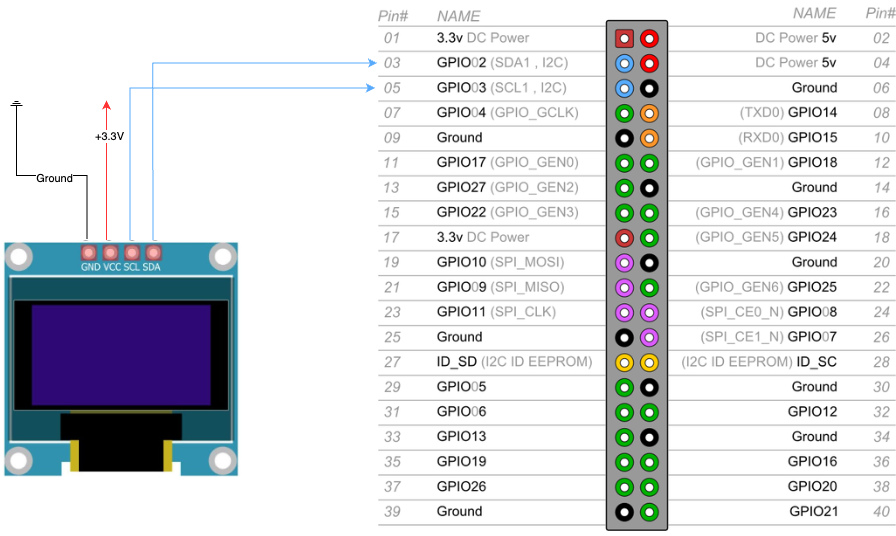

# Smart Espresso

# _**WORK IN PROGRESS**_ 
This project is a work in progress. 
The goal is to create a smart espresso machine using a Raspberry Pi 4 and a few sensors to monitor the pressure of the water in the boiler and in the head of the machine.
The pressure sensors are connected to a MCP3008 ADC and the Raspberry Pi is connected to a Home Assistant instance to monitor the pressure.


## Prerequisite

### Hardware

| Items | Description                                                                                                                      | Link                              | Notes                                                                           |
|-------|----------------------------------------------------------------------------------------------------------------------------------|-----------------------------------|---------------------------------------------------------------------------------|
| 1     | Raspberry Pi 4 Model B 2GB RAM                                                                                                   |                                   |                                                                                 |
| 1     | MCP3008-I/P MCP3008 DIP-16                                                                                                       | https://a.aliexpress.com/_olcJc4g |                                                                                 |
| 2     | Pneumatic Plumbing Brass Pipe Fitting Male/Female Thread 1/8" 1/4" 3/8" 1/2" BSP Tee Type Copper Fittings Water Oil Gas Adapter  | https://a.aliexpress.com/_okOIGjW | Choose the F-F-M 1/8"                                                           |
| 1     | Water Oil Fuel Gas Air Pressure Sensor Transducer (PT1/4 G1/2 G1/8) 5-12V 0.5-4.5V 0-300Bar Gauge Optional Consumer Electronics  | https://a.aliexpress.com/_omToNFi | Choose the 0-0.5Mpa G1-8 and write to the seller that you need the 3.3v version |   
| 1     | Water Oil Fuel Gas Air Pressure Sensor Transducer (PT1/4 G1/2 G1/8) 5-12V 0.5-4.5V 0-300Bar Gauge Optional Consumer Electronics  | https://a.aliexpress.com/_omToNFi | Choose the 0-2Mpa G1-8 and write to the seller that you need the 3.3v version   |          
| 1     | 60 Values 1/4W 1％ Metal Film Resistors Kit 300Pcs 1 ohm - 4.7M ohm 1/4 Watt W High Precision MF Resistance Set Assortment        | https://a.aliexpress.com/_oBZ1yNa |                                                                                 |
| 1     | 530pcs/Set Polyolefin Shrinking Assorted Heat Shrink Tube Wire Cable Insulated Sleeving Tubing Set 2:1 Waterproof Pipe Sleeve    | https://a.aliexpress.com/_okRXZ5m |                                                                                 |
| 1     | DIY Prototype Raspberry Pi Expansion Board PCB Shield  Compatible for Raspberry Pi 4B/3B/3B  Board For DIY Starter Projects      | https://a.aliexpress.com/_opgseK8 |                                                                                 |
| 1     | 1.3" OLED Display Module White/Blue Color Drive Chip SH1106 128X64 1.3 inch OLED LCD LED IIC I2C Communicate For ArduinoProjects | https://a.aliexpress.com/_oEzEfpA | Nice but too small                                                              |


### Tools

* Soldering iron
* Soldering wire
* Multimeter
* Ratchet wrench
* Screwdriver
* Teflon tape

## Wiring diagram
### How to wire the display to the Raspberry Pi:



| RaspberryPi  | SH1106      |
|--------------|-------------|
| Pin 6 (GND)  | Pin 1 (GND) |
| Pin 1 (3.3V) | Pin 2 (VCC) |
| Pin 5 (SCL1) | Pin 3 (SCL) |
| Pin 3 (SDA1) | Pin 4 (SDA) |


https://pinout.xyz/pinout/i2c

### How to wire the pressure sensor to the MCP3008 and the MCP3008 to the Raspberry Pi:


| RaspberryPi   | MCP3008          |
|---------------|------------------|
| Pin 1 (3.3V)  | Pin 16 (VDD)     |
| Pin 1 (3.3V)  | Pin 15 (VREF)    |
| Pin 6 (GND)   | Pin 14 (AGND)    |
| Pin 23 (SCLK) | Pin 13 (CLK)     |
| Pin 21 (MISO) | Pin 12 (DOUT)    |
| Pin 19 (MOSI) | Pin 11 (DIN)     |
| Pin 24 (CE0)  | Pin 10 (CS/SHDN) |
| Pin 6 (GND)   | Pin 9 (DGND)     |

https://pinout.xyz/pinout/spi


## Raspberry Pi configuration
### Enable SPI
```bash
sudo raspi-config
```
Select "Interfacing Options" and then "SPI" and enable it.

### Install the required packages
```bash
sudo apt-get install python3-dev python3-pip
pip3 install smart-esppresso
```

## Usage

### Params
| Key            | Description                                   |
|----------------|-----------------------------------------------|
| analog_devices | List of analog devices (PressureAnalogSensor) | 
| client_ha      | Home Assistant Client                         |
| display        | luma oled device                              |


### Example

This [example](main.py) is a simple script that reads the pressure from 2 pressure sensors, 
displays it on the OLED display and sync data with Home-assistant.

## References / credits / inspiration
* https://wiki.dfrobot.com/Gravity__Water_Pressure_Sensor_SKU__SEN0257
* https://m.youtube.com/watch?v=JlgXGrb4lVE
* https://sites.google.com/view/coffee4randy/home?authuser=0
* https://hackaday.com/2023/10/07/smart-coffee-replaces-espresso-machine-controller-with-arduino-sensors/#more-628135