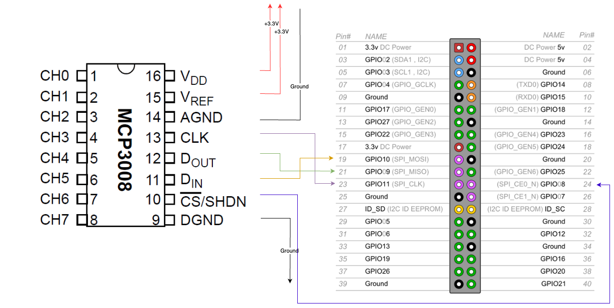

# Smart Espresso Machine Monitoring System

[](https://www.python.org/downloads/)
[](LICENSE)
[](https://github.com/idoshr/smart-espresso)

 _**WORK IN PROGRESS**_

A DIY smart espresso machine monitoring system using Raspberry Pi 4 and pressure sensors to track real-time water pressure in the boiler and brew head. Features local OLED display and optional Home Assistant integration for remote monitoring and data logging.

## 🎯 Features

- **Real-time pressure monitoring** for boiler and brew head
- **Dual ADC support**: Choose between MCP3008 (10-bit SPI) or ADS1115 (16-bit I2C)
- **Local display**: SH1106 OLED screen for at-a-glance pressure readings
- **Home Assistant integration**: Sync data for remote monitoring and automation
- **Flexible configuration**: Environment variable-based setup
- **Extensible architecture**: Easy to add new sensors or ADC types

## 📋 Table of Contents

- [Hardware Requirements](#hardware-requirements)
- [Wiring Diagrams](#wiring-diagrams)
- [Installation](#installation)
- [Configuration](#configuration)
- [Usage](#usage)
- [Project Structure](#project-structure)
- [Troubleshooting](#troubleshooting)
- [Contributing](#contributing)
- [References](#references)

## 🔧 Hardware Requirements

### Core Components

| Qty | Component | Description | Link | Notes |
|-----|-----------|-------------|------|-------|
| 1 | **Raspberry Pi 4 Model B** | 2GB RAM (or higher) | [Various retailers](https://www.raspberrypi.com/products/raspberry-pi-4-model-b/) | Main controller |
| 1 | **ADC Module** (choose one) | | | See ADC options below |
| 2 | **Pressure Sensors** | 0.5-4.5V analog output | [AliExpress](https://a.aliexpress.com/_omToNFi) | See sensor specs below |
| 1 | **OLED Display** | SH1106, 1.3", 128×64, I2C | [AliExpress](https://a.aliexpress.com/_oEzEfpA) | Optional but recommended |
| 2 | **Brass Pipe Fittings** | F-F-M 1/8" BSP Tee | [AliExpress](https://a.aliexpress.com/_okOIGjW) | For sensor mounting |

### ADC Options (Choose One)

#### Option A: MCP3008 (Recommended for beginners)
- **Type**: 10-bit SPI ADC
- **Channels**: 8 (0-7)
- **Interface**: SPI
- **Link**: [AliExpress](https://a.aliexpress.com/_olcJc4g)
- **Pros**: Simple wiring, widely documented
- **Cons**: Lower resolution (10-bit vs 16-bit)

#### Option B: ADS1115 (Recommended for better precision)
- **Type**: 16-bit I2C ADC with PGA
- **Channels**: 4 (0-3)
- **Interface**: I2C
- **Pros**: Higher resolution, programmable gain, I2C (fewer wires)
- **Cons**: Slightly more expensive
- **Note**: This is the default in the code

### Pressure Sensors

| Sensor | Range | Thread | Voltage | Purpose |
|--------|-------|--------|---------|---------|
| Boiler | 0-0.5 MPa (0-5 Bar) | G1/8 | 3.3V version | Monitor boiler pressure |
| Brew Head | 0-2 MPa (0-20 Bar) | G1/8 | 3.3V version | Monitor extraction pressure |

⚠️ **Important**: Request the **3.3V version** from the seller (not 5V) to avoid damaging your Raspberry Pi!

### Additional Components

| Qty | Item | Purpose | Link |
|-----|------|---------|------|
| 1 | **DHT22 (AM2302)** | Temperature & humidity sensor (optional) | [AliExpress](https://www.aliexpress.com/w/wholesale-dht22.html) |
| 1 | Resistor kit (1Ω - 4.7MΩ) | For voltage dividers if needed | [AliExpress](https://a.aliexpress.com/_oBZ1yNa) |
| 1 | Heat shrink tube set | Wire insulation | [AliExpress](https://a.aliexpress.com/_okRXZ5m) |
| 1 | Raspberry Pi expansion board | Prototyping (optional) | [AliExpress](https://a.aliexpress.com/_opgseK8) |

### DHT22 Temperature & Humidity Sensor (Optional)

- **Range**: -40°C to 80°C, 0-100% humidity
- **Accuracy**: ±0.5°C, ±2-5% RH
- **Interface**: Digital (single-wire protocol)
- **Power**: 3.3V or 5V (5V recommended for better range)
- **Note**: Most modules include built-in pull-up resistor

### Tools Required

- Soldering iron & solder wire
- Multimeter (for testing connections)
- Ratchet wrench (for pipe fittings)
- Screwdrivers
- Teflon tape (for pressure-tight seals)
- Wire strippers
- Heat gun (for heat shrink tubing)


## 🔌 Wiring Diagrams

### OLED Display (SH1106) → Raspberry Pi (I2C)


| Raspberry Pi Pin | Function | → | SH1106 Display Pin |
|------------------|----------|---|--------------------|
| Pin 1 | 3.3V Power | → | VCC |
| Pin 3 | SDA1 (I2C Data) | → | SDA |
| Pin 5 | SCL1 (I2C Clock) | → | SCL |
| Pin 6 | Ground | → | GND |

📖 [Raspberry Pi I2C Pinout Reference](https://pinout.xyz/pinout/i2c)

---

### Option A: MCP3008 ADC → Raspberry Pi (SPI)



| Raspberry Pi Pin | Function | → | MCP3008 Pin |
|------------------|----------|---|-------------|
| Pin 1 | 3.3V Power | → | Pin 16 (VDD) |
| Pin 1 | 3.3V Power | → | Pin 15 (VREF) |
| Pin 6 | Ground | → | Pin 14 (AGND) |
| Pin 23 | SCLK (SPI Clock) | → | Pin 13 (CLK) |
| Pin 21 | MISO (SPI Data Out) | → | Pin 12 (DOUT) |
| Pin 19 | MOSI (SPI Data In) | → | Pin 11 (DIN) |
| Pin 24 | CE0 (Chip Select) | → | Pin 10 (CS/SHDN) |
| Pin 6 | Ground | → | Pin 9 (DGND) |

**Pressure Sensor Connections:**
- Sensor VCC → 3.3V (share with MCP3008)
- Sensor GND → Ground (share with MCP3008)
- Sensor OUT → MCP3008 CH0 (Pin 1) for Head sensor
- Sensor OUT → MCP3008 CH1 (Pin 2) for Boiler sensor

📖 [Raspberry Pi SPI Pinout Reference](https://pinout.xyz/pinout/spi)

---

### Option B: ADS1115 ADC → Raspberry Pi (I2C)

| Raspberry Pi Pin | Function | → | ADS1115 Pin |
|------------------|----------|---|-------------|
| Pin 1 | 3.3V Power | → | VDD |
| Pin 3 | SDA1 (I2C Data) | → | SDA |
| Pin 5 | SCL1 (I2C Clock) | → | SCL |
| Pin 6 | Ground | → | GND |

**Pressure Sensor Connections:**
- Sensor VCC → 3.3V (can share with ADS1115)
- Sensor GND → Ground (share with ADS1115)
- Sensor OUT → ADS1115 A0 for Head sensor
- Sensor OUT → ADS1115 A1 for Boiler sensor

**I2C Address:** Default is `0x48`. Can be changed via ADDR pin if needed.

💡 **Tip**: ADS1115 and SH1106 display can share the same I2C bus, making wiring simpler!

---

### DHT22 Temperature & Humidity Sensor → Raspberry Pi (GPIO)

| Raspberry Pi Pin | Function | → | DHT22 Pin |
|------------------|----------|---|-----------|
| Pin 2 | 5V Power | → | VCC/+ |
| Pin 7 | GPIO4 (Digital) | → | DATA/OUT |
| Pin 6 | Ground | → | GND/- |

**Alternative GPIO Pins** (if GPIO4 is unavailable):
- GPIO17 (Pin 11)
- GPIO27 (Pin 13)
- GPIO22 (Pin 15)

**Important Notes:**
- Most DHT22 modules have a built-in pull-up resistor
- If yours doesn't, add a 4.7kΩ - 10kΩ resistor between VCC and DATA pins
- 5V power is recommended for better range and stability (3.3V also works)
- Keep wiring under 20cm for reliability (or use shielded cable)
- DHT22 can only be sampled every 2 seconds (max 0.5Hz)

💡 **Tip**: GPIO4 is recommended as it doesn't conflict with SPI (MCP3008) or I2C (ADS1115/Display) interfaces!


## 📦 Installation

### Step 1: Raspberry Pi Configuration

#### Enable Required Interfaces

```bash
sudo raspi-config
```

**For MCP3008 (SPI):**
- Navigate to: `Interface Options` → `SPI` → `Enable`

**For ADS1115 and Display (I2C):**
- Navigate to: `Interface Options` → `I2C` → `Enable`

💡 **Tip**: Enable both if you might switch ADC types in the future!

#### Verify Interfaces

```bash
# Check I2C devices (should show 0x3C for display, 0x48 for ADS1115)
sudo i2cdetect -y 1

# Check SPI devices (if using MCP3008)
ls -l /dev/spidev*
```

### Step 2: Install System Dependencies

```bash
# Update system packages
sudo apt-get update
sudo apt-get upgrade -y

# Install Python development tools
sudo apt-get install -y python3-dev python3-pip git

# Install I2C tools (optional but helpful)
sudo apt-get install -y i2c-tools
```

### Step 3: Install Smart Espresso Package

#### Option A: Install from PyPI (Recommended)

```bash
pip3 install smart-esppresso
```

#### Option B: Install from Source (For Development)

```bash
# Clone the repository
git clone https://github.com/idoshr/smart-espresso.git
cd smart-espresso

# Install in development mode
pip3 install -e .

# Or install dependencies manually
pip3 install -r requirements.txt
```

### Step 4: Verify Installation

```python3
python3 -c "from smart_espresso.smart_espresso import SmartEspresso; print('Installation successful!')"
```


## ⚙️ Configuration

The system uses environment variables for configuration. You can set these in your shell or create a `.env` file.

### Environment Variables

| Variable | Description | Default | Required |
|----------|-------------|---------|----------|
| `ADC_TYPE` | ADC type: `"MCP3008"` or `"ADS1115"` | `"ADS1115"` | No |
| `HA_ENABLE` | Enable Home Assistant integration | `False` | No |
| `HA_URL` | Home Assistant URL | None | If HA_ENABLE=True |
| `HA_TOKEN` | Home Assistant long-lived access token | None | If HA_ENABLE=True |
| `HA_VERIFY_SSL` | Verify SSL certificates | `True` | No |

### Configuration Examples

#### Basic Setup (No Home Assistant)

```bash
export ADC_TYPE="ADS1115"  # or "MCP3008"
```

#### With Home Assistant

```bash
export ADC_TYPE="ADS1115"
export HA_ENABLE="True"
export HA_URL="http://192.168.1.100:8123"
export HA_TOKEN="your_long_lived_access_token_here"
export HA_VERIFY_SSL="True"
```

#### Creating a .env File

```bash
# Create a .env file in your project directory
cat > .env << EOF
ADC_TYPE=ADS1115
HA_ENABLE=True
HA_URL=http://192.168.1.100:8123
HA_TOKEN=your_token_here
HA_VERIFY_SSL=True
EOF
```

### Getting a Home Assistant Token

1. Log in to your Home Assistant instance
2. Click on your profile (bottom left)
3. Scroll down to "Long-Lived Access Tokens"
4. Click "Create Token"
5. Give it a name (e.g., "Smart Espresso")
6. Copy the token and use it in `HA_TOKEN`


## 🚀 Usage

### Quick Start

See the complete example in [main.py](main.py).

### Basic Usage (Without Display)

```python
import os
from smart_espresso.analog_sensor.ads1115_analog_sensor import ADS1115ADC
from smart_espresso.analog_sensor.pressure_analog_sensor import PressureAnalogSensor
from smart_espresso.smart_espresso import SmartEspresso

# Create pressure sensors using ADS1115
analog_devices = [
    PressureAnalogSensor(
        adc=ADS1115ADC(pin=0, gain=2/3),
        name="Head"
    ),
    PressureAnalogSensor(
        adc=ADS1115ADC(pin=1, gain=2/3),
        name="Boiler"
    ),
]

# Run without display
se = SmartEspresso(
    analog_devices=analog_devices,
    client_ha=None,
    display=None
)
se.run()
```

### With OLED Display

```python
from luma.core.interface.serial import i2c
from luma.oled.device import sh1106
from smart_espresso.analog_sensor.ads1115_analog_sensor import ADS1115ADC
from smart_espresso.analog_sensor.pressure_analog_sensor import PressureAnalogSensor
from smart_espresso.smart_espresso import SmartEspresso

# Initialize display
display = sh1106(i2c(port=1, address=0x3C), width=128, height=64, rotate=0)

# Create sensors
analog_devices = [
    PressureAnalogSensor(adc=ADS1115ADC(pin=0, gain=2/3), name="Head"),
    PressureAnalogSensor(adc=ADS1115ADC(pin=1, gain=2/3), name="Boiler"),
]

# Run with display
se = SmartEspresso(
    analog_devices=analog_devices,
    client_ha=None,
    display=display
)
se.run()
```

### With Home Assistant Integration

```python
import os
from homeassistant_api import Client
from smart_espresso.analog_sensor.ads1115_analog_sensor import ADS1115ADC
from smart_espresso.analog_sensor.pressure_analog_sensor import PressureAnalogSensor
from smart_espresso.smart_espresso import SmartEspresso
from smart_espresso.utils import strtobool

# Setup Home Assistant client
HA_ENABLE = strtobool(os.environ.get("HA_ENABLE", "False"))
client_ha = None

if HA_ENABLE:
    HA_URL = os.environ.get("HA_URL")
    HA_TOKEN = os.environ.get("HA_TOKEN")
    HA_VERIFY_SSL = strtobool(os.environ.get("HA_VERIFY_SSL", "True"))
    
    if not HA_URL or not HA_TOKEN:
        raise ValueError("HA_URL and HA_TOKEN are required when HA_ENABLE is True")
    
    print("Connecting to Home Assistant...")
    client_ha = Client(f"{HA_URL}/api", HA_TOKEN, verify_ssl=HA_VERIFY_SSL)

# Create sensors
analog_devices = [
    PressureAnalogSensor(adc=ADS1115ADC(pin=0, gain=2/3), name="Head"),
    PressureAnalogSensor(adc=ADS1115ADC(pin=1, gain=2/3), name="Boiler"),
]

# Run with Home Assistant sync
se = SmartEspresso(
    analog_devices=analog_devices,
    client_ha=client_ha,
    display=None
)
se.run()
```

### Using MCP3008 Instead of ADS1115

```python
from smart_espresso.analog_sensor.mcp3008_analog_sensor import MCP3008ADC
from smart_espresso.analog_sensor.pressure_analog_sensor import PressureAnalogSensor
from smart_espresso.smart_espresso import SmartEspresso

# Create sensors using MCP3008
analog_devices = [
    PressureAnalogSensor(adc=MCP3008ADC(pin=0), name="Head"),
    PressureAnalogSensor(adc=MCP3008ADC(pin=1), name="Boiler"),
]

se = SmartEspresso(
    analog_devices=analog_devices,
    client_ha=None,
    display=None
)
se.run()
```

### With DHT22 Temperature & Humidity Sensor

```python
from smart_espresso.analog_sensor.ads1115_analog_sensor import ADS1115ADC
from smart_espresso.analog_sensor.pressure_analog_sensor import PressureAnalogSensor
from smart_espresso.analog_sensor.dht22_sensor import DHT22Sensor
from smart_espresso.smart_espresso import SmartEspresso

# Create pressure sensors (analog)
analog_devices = [
    PressureAnalogSensor(adc=ADS1115ADC(pin=0, gain=2/3), name="Head"),
    PressureAnalogSensor(adc=ADS1115ADC(pin=1, gain=2/3), name="Boiler"),
]

# Create DHT22 temperature and humidity sensor (digital)
digital_sensors = [
    DHT22Sensor(
        pin=4,  # GPIO4 (Physical Pin 7)
        name="Environment",
        use_fahrenheit=False  # Set to True for Fahrenheit
    )
]

# Run with both analog and digital sensors
se = SmartEspresso(
    analog_devices=analog_devices,
    digital_sensors=digital_sensors,
    client_ha=None,
    display=None
)
se.run()
```

💡 **Note**: See [example_dht22.py](example_dht22.py) for a complete working example with display and Home Assistant integration.

### Running as a System Service

To run the monitoring system automatically on boot:

1. Create a systemd service file:

```bash
sudo nano /etc/systemd/system/smart-espresso.service
```

2. Add the following content:

```ini
[Unit]
Description=Smart Espresso Monitoring System
After=network.target

[Service]
Type=simple
User=pi
WorkingDirectory=/home/pi/smart-espresso
Environment="ADC_TYPE=ADS1115"
Environment="HA_ENABLE=True"
Environment="HA_URL=http://192.168.1.100:8123"
Environment="HA_TOKEN=your_token_here"
ExecStart=/usr/bin/python3 /home/pi/smart-espresso/main.py
Restart=always
RestartSec=10

[Install]
WantedBy=multi-user.target
```

3. Enable and start the service:

```bash
sudo systemctl daemon-reload
sudo systemctl enable smart-espresso.service
sudo systemctl start smart-espresso.service
sudo systemctl status smart-espresso.service
```

### SmartEspresso Class Parameters

| Parameter | Type | Description | Default |
|-----------|------|-------------|---------|
| `analog_devices` | `list[AnalogSensor]` | List of pressure sensors | Required |
| `client_ha` | `Client` or `None` | Home Assistant API client | `None` |
| `display` | `sh1106` or `None` | OLED display device | `None` |
| `render_interval` | `float` | Update interval in seconds | `0.1` |


## 📁 Project Structure

```
smart_espresso/
├── smart_espresso/
│   ├── __init__.py
│   ├── smart_espresso.py           # Main SmartEspresso class
│   ├── utils.py                    # Helper functions (strtobool, font)
│   ├── Roboto-Regular.ttf          # Font for OLED display
│   └── analog_sensor/
│       ├── __init__.py
│       ├── analog_sensor.py        # Base classes (AnalogSensor, ADCInterface)
│       ├── mcp3008_analog_sensor.py # MCP3008 10-bit SPI ADC implementation
│       ├── ads1115_analog_sensor.py # ADS1115 16-bit I2C ADC implementation
│       ├── pressure_analog_sensor.py # Pressure sensor with MPa/Bar conversion
│       └── water_flow_sensor.py    # Flow sensor (future feature)
├── test/
│   └── test_smart_espresso.py      # Unit tests
├── docs/
│   └── img/                        # Wiring diagrams
├── main.py                         # Example usage script
├── requirements.txt                # Python dependencies
├── pyproject.toml                  # Package configuration
└── README.md                       # This file
```

### Key Components

#### Base Classes

- **`ADCInterface`**: Abstract interface for ADC implementations
  - `read()`: Returns normalized value (0.0-1.0)
  
- **`AnalogSensor`**: Base class for all analog sensors
  - `read()`: Read and store current value
  - `update_home_assistant()`: Sync to HA
  - `message`: Property for display text

#### ADC Implementations

- **`MCP3008ADC`**: 10-bit SPI ADC
  - Uses `gpiozero` library
  - 8 channels (pins 0-7)
  
- **`ADS1115ADC`**: 16-bit I2C ADC
  - Uses `adafruit-circuitpython-ads1x15` library
  - 4 channels (pins 0-3)
  - Programmable gain amplifier
  - Shared I2C bus support

#### Sensor Implementations

- **`PressureAnalogSensor`**: Pressure monitoring
  - Converts voltage to MPa and Bar
  - Auto-calibration to lowest reading
  - Formatted messages for display

## 🔧 Troubleshooting

### Common Issues

#### No I2C/SPI Devices Detected

```bash
# Check if interfaces are enabled
sudo raspi-config
# Enable I2C and/or SPI under Interface Options

# Verify I2C devices
sudo i2cdetect -y 1

# Check SPI devices
ls -l /dev/spidev*
```

#### Incorrect Pressure Readings

- **Verify sensor voltage**: Must be 3.3V version (not 5V)
- **Check wiring**: Use multimeter to verify connections
- **Calibrate offsets**: Adjust `OFFSET_VOLTAGE` and `OFFSET` in `PressureAnalogSensor`
- **Let it auto-calibrate**: Readings stabilize after a few minutes

#### Display Not Working

```bash
# Check I2C address (usually 0x3C)
sudo i2cdetect -y 1

# Try different I2C addresses if needed
display = sh1106(i2c(port=1, address=0x3C), width=128, height=64)
```

#### Home Assistant Connection Failed

- **Verify HA URL**: Must include `http://` or `https://`
- **Check token**: Generate a new long-lived access token
- **Network connectivity**: Ensure Pi can reach HA server
  ```bash
  ping 192.168.1.100  # Replace with your HA IP
  ```
- **SSL issues**: Set `HA_VERIFY_SSL=False` if using self-signed certificates

#### Permission Errors (SPI/I2C)

```bash
# Add user to required groups
sudo usermod -a -G spi,i2c,gpio pi

# Reboot for changes to take effect
sudo reboot
```

#### Import Errors

```bash
# Reinstall dependencies
pip3 install --upgrade --force-reinstall smart-esppresso

# Or install from requirements.txt
pip3 install -r requirements.txt
```

### Debugging Tips

1. **Enable verbose logging**: Add print statements in sensor `read()` methods
2. **Test ADC directly**: Read raw values to verify hardware
3. **Check voltage levels**: Use multimeter on sensor output
4. **Monitor CPU temperature**: Overheating can cause instability
   ```bash
   vcgencmd measure_temp
   ```

## 🤝 Contributing

Contributions are welcome! Here's how you can help:

### Development Setup

```bash
# Clone the repository
git clone https://github.com/idoshr/smart-espresso.git
cd smart-espresso

# Create a virtual environment
python3 -m venv venv
source venv/bin/activate

# Install in development mode
pip install -e .

# Install development dependencies
pip install pytest black isort
```

### Running Tests

```bash
# Run all tests
python3 -m pytest smart_espresso/test/

# Run with coverage
python3 -m pytest --cov=smart_espresso smart_espresso/test/
```

### Code Style

This project uses:
- **Black** for code formatting (line length: 88)
- **isort** for import sorting
- **Type hints** for Python 3.8+

```bash
# Format code
black smart_espresso/
isort smart_espresso/
```

### Adding New Features

1. **New ADC support**: Implement `ADCInterface` in `analog_sensor/`
2. **New sensor types**: Extend `AnalogSensor` class
3. **Display improvements**: Modify rendering in `SmartEspresso.run()`
4. **Documentation**: Update README and add docstrings

### Submitting Changes

1. Fork the repository
2. Create a feature branch (`git checkout -b feature/amazing-feature`)
3. Commit your changes (`git commit -m 'Add amazing feature'`)
4. Push to the branch (`git push origin feature/amazing-feature`)
5. Open a Pull Request

## 📄 License

This project is licensed under the BSD 3-Clause License - see the [LICENSE](LICENSE) file for details.

## 🙏 References / Credits / Inspiration

* [DFRobot Gravity Water Pressure Sensor](https://wiki.dfrobot.com/Gravity__Water_Pressure_Sensor_SKU__SEN0257)
* [YouTube: DIY Espresso Machine Monitoring](https://m.youtube.com/watch?v=JlgXGrb4lVE)
* [Coffee4Randy's Smart Espresso Project](https://sites.google.com/view/coffee4randy/home?authuser=0)
* [Hackaday: Smart Coffee ESP32 Controller](https://hackaday.com/2023/10/07/smart-coffee-replaces-espresso-machine-controller-with-arduino-sensors/#more-628135)
* [Raspberry Pi GPIO Pinout](https://pinout.xyz)
* [Luma.OLED Documentation](https://luma-oled.readthedocs.io/)
* [Home Assistant API](https://www.home-assistant.io/integrations/api/)

---

**Made with ☕ and ❤️ by coffee enthusiasts, for coffee enthusiasts**

